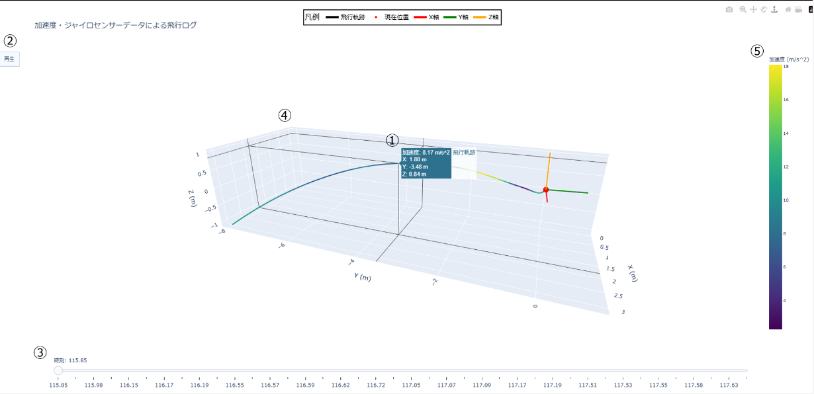

# 針路可視化できるマン

csvデータを元にPythonのフレームワークであるplotlyを用いて飛行針路を描画するコードです

## 内容物

- data.py 加速度を見れないレガシーコード
- data1.py 加速度を見れる優秀なコード(必要)
- sensor_data50.csv 3/31に飛ばしたロケットのセンサーデータ(必要)
- event_log50.py 飛行に関するイベントのログデータ

## 初期セットアップの方法

22行目のファイル名を確認してください。異なる場合は、以下のコード内のファイル名を変更してください。
3/31の飛行データの閲覧はこのままできます。

```python
df = pd.read_csv("sensor_data50.csv")
```

::: note info
動かなかったときは
以下のコマンドを入力して、必要なライブラリをインストールしてください。

```shell
pip install pandas
pip install scipy
pip install plotly
```

ライブラリ不足以外のエラー発生時はIssuesにエラー内容とともに書き込みお願いします

:::

## 画面


### 1.加速度及びXYZ座標の表示

- 飛行経路にマウスカーソルを重ねるとその地点のXYZ座標、その瞬間の加速度が見ることができます
- 飛行開始直後のデータが欠損しているため、最後の地点から逆算して高さを求めてください。
- 加速度はそのまま読んで大丈夫です。ロケットのやや後方に配置されているので少し値が前後する可能性があります

### 2.再生ボタン

- クリックすると赤い点とXYZのジャイロの線が突き刺さっている物体が飛行経路に合わせて動きます。

### 3.時刻スライダー

- スライダーの白い丸を動かすと赤い点とジャイロの線が突き刺さってる物体が動きます。

### 4.飛行経路表示グラフエリア

- キャンバスをマウス左クリックしながら回すと回転させられます
- キャンバスをマウス右クリックしながら回すとグラフの位置を変えることができます
- マウスホイールでズームイン、ズームアウトも可能です
- 学校のタブレットPCについてくるトラックパットでも一応動作することは確認していますが、マウスを使ったほうがストレスなく操作できます。

### 5.加速度の凡例

- 飛行経路に加速度に合わせた色がつきます。その色の凡例です。

## csvファイル内カラムの説明

### Time_s

- 見ての通り時間です単位は秒(s)
- 3/31の実験でのデータでは飛行判定前と後のファイルに分かれていてそのファイル間で1秒ほど記録開始にラグがあります

### Temperature_C,Humidity_%,Pressure_hPa,

- それぞれ気温、湿度、気圧を示しています
- 単位はそれぞれ℃、％、hPaです

### Lat,Lng,Alt_m,Fix,Sats,

- 緯度、経度、高さ(m)、結果、拾った衛星の数をし増しています

### AccelX_g,AccelY_g,AccelZ_g,

- XYZ軸の加速度データの値です

### GyroX_deg_s,GyroY_deg_s,GyroZ_deg_s,

- ジャイロセンサーからの値です

### TotalAccel

- 合計の加速度です